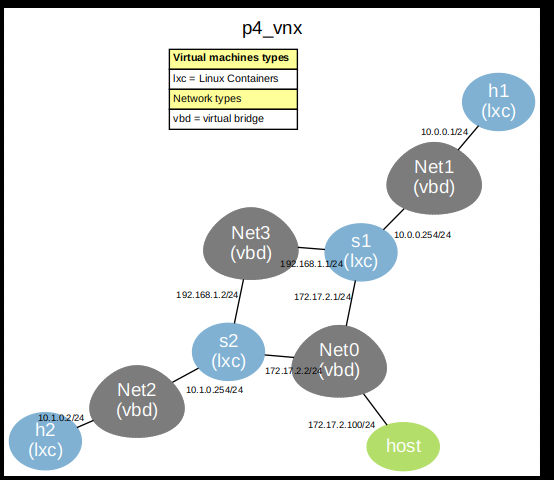

# ESCENARIO VNX CON SWITCH P4 BMv2

## INDICE 
- [Instrucciones ](#instrucciones)
  - [Instrucciones ](#ejecutar-escenario)
- [Modificación de Imagen LXC ](#modificar-imagen-de-vnx)
- [Continuar...]


## TOPOLOGIA


## INSTRUCCIONES:

### Ejecutar escenario.

```python
sudo vnx -f p4_vnx.xml -v --create 
```

al finalizar para limpiar escenario.

```python
sudo vnx -f p4_vnx.xml -v --destroy 

```
O utilizar 

```python
sudo vnx --clean-host

```


# Iniciar BMv2 con TMUX
Se necesita iniciar el switch desde VNX sin necesidad de ejecutarlo en segundo plano "&" porque dará error, si dejamos ejecutarlo en primer plano bloquea la continuacion de creacion del escenario de VNX, por lo que es necesario, instalar TMUX que permitirá iniciar un nuevo terminal y asi mantener el switch en ejeccución sin necesidad de forzar su ejeccución en segundo plano, lo que si será necesario es acceder a una segunda consola para ver el proceso iniciado.

Para iniciar el Switch será necesario realizarlo de 2 formas:
- Ingresar hasta la carpeta donde esta el switch BMv2 (`cd /behavioral-model/targets/simple_switch_grpc/`)

 ```python
  cd /behavioral-model/targets/simple_switch_grpc/
      tmux new-session -d -s switch2 simple_switch_grpc --no-p4 \
        -i 1@eth1 -i 2@eth2 --thrift-port 9091 --device-id 2
 ```


- Crear un PATH que permita recortar la ubicación del SWitch desde cualquier lugar. `export PATH=$PATH:/behavioral-model/targets/simple_switch_grpc/`


   ```python
     export PATH=$PATH:/behavioral-model/targets/simple_switch_grpc/
      tmux new-session -d -s switch1 simple_switch_grpc --no-p4 \
        -i 1@eth1 -i 2@eth2 --thrift-port 9090 --device-id 1
   ```


El escenario se creará y veremos creados h1, h2, s1, s2, los switch también se han inicializado de forma automática por la instalacion tmux que permite tener una consola adicional para mantener activo el servicio del switch (se comenta lineas abajo)

```python
sudo vnx -f p4_vnx.xml -v --create

```
En esta vista se observa la creacion y ejecución de BMv2 en el switch s2, iniciado de forma automática.

```python
host>      Created new process 65407 for vm 's2'
Calling execute_cmd for vm 's2' with seq 'on_boot'...
lxc-execute_cmd-s2>  /usr/bin/rm -rf /root/.vnx/scenarios/p4_vnx/vms/s2/tmp/on_boot/filetree/1
lxc-execute_cmd-s2>  executing user defined exec command:
lxc-execute_cmd-s2>      sleep 3;
lxc-execute_cmd-s2>      tmux new-session -d -s switch2 /behavioral-model/targets/simple_switch_grpc/simple_switch_grpc --no-p4  -i 1@eth1 -i 2@eth2 --thrift-port 9091 --device-id 2;
lxc-execute_cmd-s2>      echo "Switch iniciado" >> /root/start_s2.log;
lxc-execute_cmd-s2>  /usr/bin/lxc-attach --clear-env -n s2 -- /bin/bash -l -c 'sleep 3;tmux new-session -d -s switch2 /behavioral-model/targets/simple_switch_grpc/simple_switch_grpc --no-p4  -i 1@eth1 -i 2@eth2 --thrift-port 9091 --device-id 2;\necho "Switch iniciado" >> /root/start_s2.log;\n'
...execute_cmd for vm 's2' with seq 'on_boot' returns OK
```


Luego de ello solo hace falta poblar las tablas, para ello utilizamos el archivo de python que se llama contrador.py que contiene la configuracion de IP, ID, puerto y tablas de cada switch y con ello de subirá la lógica de p4 (my_program) que se encuentra en los archivos compilados y son necesarios para esta tarea como se indica en el archivo controlador.py

```python
sudo python3 controlador.py 
```

Se trendrá una vista similar a la siguiente que indica que se han poblados las tablas en los switch 1 y 2


```python
ibdn@ibdn-VirtualBox:~/TFG_P4-main/TFG_P4-main/LXC-VNX-P4-BMv2$ sudo python3 controlador.py 
Adding default action to: ipv4_lpm
action: drop
Adding entry to: ipv4_lpm
match:
field_id: 1
lpm {
  value: "\n\000\000\001"
  prefix_len: 32
}

action: ipv4_forward
param_id: 1
value: "\002\375\000\000\000\001"

param_id: 2
value: "\000\001"

Adding entry to: ipv4_lpm
match:
field_id: 1
lpm {
  value: "\n\001\000\000"
  prefix_len: 24
}

action: ipv4_forward
param_id: 1
value: "\002\375\000\000\003\002"

param_id: 2
value: "\000\002"

Adding entry to: ipv4_lpm
match:
field_id: 1
lpm {
  value: "\254\021\002\000"
  prefix_len: 24
}

action: ipv4_forward
param_id: 1
value: "\002\375\000\000\002\003"

param_id: 2
value: "\000\003"

Adding default action to: ipv4_lpm
action: drop
Adding entry to: ipv4_lpm
match:
field_id: 1
lpm {
  value: "\n\001\000\002"
  prefix_len: 32
}

action: ipv4_forward
param_id: 1
value: "\002\375\000\000\001\001"

param_id: 2
value: "\000\001"

Adding entry to: ipv4_lpm
match:
field_id: 1
lpm {
  value: "\n\000\000\000"
  prefix_len: 24
}

action: ipv4_forward
param_id: 1
value: "\002\375\000\000\002\002"

param_id: 2
value: "\000\002"

Adding entry to: ipv4_lpm
match:
field_id: 1
lpm {
  value: "\254\021\002\000"
  prefix_len: 24
}

action: ipv4_forward
param_id: 1
value: "\002\375\000\000\003\003"

param_id: 2
value: "\000\003"

ibdn@ibdn-VirtualBox:~/TFG_P4-main/TFG_P4-main/LXC-VNX-P4-BMv2$ 
```

Luego realizamos pruebas de ping de h1 a h2 


```python
PING 10.1.0.2 (10.1.0.2) 56(84) bytes of data.
64 bytes from 10.1.0.2: icmp_seq=1 ttl=62 time=1.67 ms
64 bytes from 10.1.0.2: icmp_seq=2 ttl=62 time=1.20 ms
64 bytes from 10.1.0.2: icmp_seq=3 ttl=62 time=1.09 ms
64 bytes from 10.1.0.2: icmp_seq=4 ttl=62 time=1.93 ms
64 bytes from 10.1.0.2: icmp_seq=5 ttl=62 time=1.12 ms
64 bytes from 10.1.0.2: icmp_seq=6 ttl=62 time=0.860 ms
64 bytes from 10.1.0.2: icmp_seq=7 ttl=62 time=1.02 ms
```

Si se desea ver el procesamiento de tablas conectarse a tmux


### Modificar imagen de VNX 

### SWITCH P4 BMv2 en LXC


Tener descargado los LXC

```
ibdn@ibdn-VirtualBox:/usr/share/vnx/filesystems$ ls 
rootfs_lxc_ubuntu64/
rootfs_lxc_vyos/
rootfs_lxc_vyos64/
vnx_rootfs_lxc_ubuntu64-20.04-v025-vnxlab/
vnx_rootfs_lxc_ubuntu64-20.04-v025-vnxlab.tgz
vnx_rootfs_lxc_ubuntu64-22.04-v025/
vnx_rootfs_lxc_ubuntu64-22.04-v025.tgz
vnx_rootfs_lxc_vyos64-1.3-v025/22
vnx_rootfs_lxc_vyos64-1.3-v025.tgz
ibdn@ibdn-VirtualBox:/usr/share/vnx/filesystems$ ls rootfs_lxc_ubuntu64/
```

El escenario de prueba de un escneario de VNX podemos ver el archivo `tutorial_lxc_ubuntu64.xml` utiliza la ruta rootfs_lxc_ubuntu64 en esta carpeta tiene que contener los archivos LXC 


```python
    <filesystem type="cow">/usr/share/vnx/filesystems/rootfs_lxc_ubuntu64</filesystem>
```
En caso no los tenga los descargamos:

```python
cd /usr/share/vnx/filesystems
vnx_download_rootfs
```

del listado descargar el numero 150 y procedemos a confirmar con si o y los mensajes para que se instale. 

```python
150  vnx_rootfs_lxc_ubuntu64-20.04-v025-vnxlab.tgz                2022-03-13    1.2G
```
dado que el esccenario esta con una ruta predeterminada al momento de realizar el despligue del escenario VNX  procedemos  a descomprimir en la ruta por defecto

```python
cd /usr/share/vnx/filesystems
sudo tar -xzvf vnx_rootfs_lxc_ubuntu64-20.04-v025-vnxlab.tgz -C rootfs_lxc_ubuntu64
```

luego de ello procedemos a limpiar el escenario y realizar el despliegue 

```python
sudo vnx --clean-host
sudo vnx -f tutorial_lxc_ubuntu64.xml -v --create 
```
esto es de un tutorial de la practica de VNX

```python
mkdir p31 
cd p31 
wget http://vnx.dit.upm.es/vnx/examples/tutorial/tutorial_lxc_ubuntu.tgz 
tar xfz tutorial_lxc_ubuntu.tgz 
cd tutorial_lxc_ubuntu/ 
```


Modificar imagen de VNX (https://web.dit.upm.es/vnxwiki/index.php/Vnx-modify-rootfs)


```python
cd /usr/share/vnx/filesystems
sudo vnx --modify-rootfs rootfs_lxc_ubuntu64
```

```python
ibdn@ibdn-VirtualBox:/usr/share/vnx/filesystems$ sudo vnx --modify-rootfs rootfs_lxc_ubuntu64
```
digitar credenciales 

```python
usuario:root
contraseña: xxxx
```

Clonar las librerias dentro del LXC de BMv2

Fuente: https://github.com/p4lang/behavioral-model


## INSTALACIÓN LIGERA DE BMv2 sin Compilador P4C (removoer el paquete p4lang-p4c del listado) 

Listado de paquetes necesarios, copiar y pegar luego de ingresra 


```python


# Instalar dependencias mínimas, tmux para iniciar bmv2 en un nuevo terminal. #libboost-all-dev thrift-compiler && \tcpdump
apt-get update && apt-get install -y --no-install-recommends \
    curl gnupg software-properties-common sudo iproute2 iputils-ping graphviz \
    python3 python3-pip git nano lsof net-tools \
    tmux  \
    graphviz     
    

# Añadir repositorio y clave de P4lang
. /etc/os-release && \
    echo "deb http://download.opensuse.org/repositories/home:/p4lang/xUbuntu_${VERSION_ID}/ /" | tee /etc/apt/sources.list.d/home:p4lang.list && \
    curl -fsSL "https://download.opensuse.org/repositories/home:p4lang/xUbuntu_${VERSION_ID}/Release.key" | gpg --dearmor | tee /etc/apt/trusted.gpg.d/home_p4lang.gpg > /dev/null && \
    apt-get update && \
    apt-get install -y p4lang-bmv2 p4lang-p4c  && \
    rm -rf /var/lib/apt/lists/*
    
    
# Limpiar la caché de apt
RUN rm -rf /var/lib/apt/lists/*


# Clonar repositorio con librerias de P4, con ejemplos.

git clone https://github.com/p4lang/behavioral-model.git


```

```markdown
sudo apt update
sudo systemctl restart apache2
```


#### validar que hay BMv2 instalador en LXC

```
which simple_switch_grpc
```


 
Exportar y comprimir imagen


Comprimir imagen con modificaciones realizadas y asi tener la opcion de recuperacion de la imagen `rootfs_lxc_ubuntu64_p4.tgz``

```python
cd /usr/share/vnx/filesystems/
sudo tar czvf rootfs_lxc_ubuntu64_p4-22.04.tgz rootfs_lxc_ubuntu64
```

### Crear programa p4 en LXC my_programa.p4
```python
cd /behavioral-model/targets/simple_switch_grpc/
nano my_program.p4
```
(Copia contenido de p4 para se compile con p4c y asi se cree los archivos *.json, *.txt y el archivo *.p4i)

```python
nano my_program.p4
p4c --target bmv2 --arch v1model --p4runtime-files my_program.p4rt.txt my_program.p4
```

funciona con el comando
```python
chmod +x /behavioral-model/targets/simple_switch_grpc/simple_switch_grpc
```

#### S1 

Iniciar SWITCH BMv2 en consola 1.

EN CONSOLA 1
En caso de error ingresar hasta la carpeta del target que se necesita y luego ejecutar el comando.
La consola iniciará el Sw y se quedará con logs, y se necesita una segunda consola para poder poblar las tablas.
El LXC tiene 3 puertos pero solo se utilizara 2 para conectar el BMv2 a las interfaces y el trafico pueda pasar por el Sw BMv2 dentro del Sw.
El SW BMv2 se inicará unicamente con los 2 puertos que se necesitan, de igual forma se tendrá conexion al Sw mediante el IP que tiene la eth3 del LXC que esta conectado a la red segun los que ha definido en el archivo de VNX.


```python

 
  ./my_program.json
```

En una sola linea

```python
/behavioral-model/targets/simple_switch_grpc/
simple_switch_grpc \
  -i 1@eth1 -i 2@eth2 \
  --log-console \
  --thrift-port 9090 \
  --device-id 1 \
/behavioral-model/targets/simple_switch_grpc/my_program.json
```


EN CONSOLA 2 de S1, abrir con el comando desde el host:

```python
ibdn@ibdn-VirtualBox:~/TFG_P4-main/TFG_P4-main$ sudo vnx -f p4_vnx.xml -v -console -M s1
```

Ver puede observar el Sw BMv2 con el PID 313 que tiene 2 puertos uno de grpc y el thrift 


```python
root@s1:~# sudo lsof -i
COMMAND   PID            USER   FD   TYPE DEVICE SIZE/OFF NODE NAME
systemd-r  95 systemd-resolve   13u  IPv4 237875      0t0  UDP localhost:domain 
systemd-r  95 systemd-resolve   14u  IPv4 237876      0t0  TCP localhost:domain (LISTEN)
sshd      190            root    3u  IPv4 239177      0t0  TCP *:ssh (LISTEN)
sshd      190            root    4u  IPv6 239179      0t0  TCP *:ssh (LISTEN)
simple_sw 313            root   13u  IPv6 248243      0t0  TCP *:9559 (LISTEN)
simple_sw 313            root   20u  IPv4 248252      0t0  TCP *:9090 (LISTEN)
root@s1:~# 
```

Verifica el puerto gRPC
Después de iniciar el switch, verifica que el puerto gRPC está activo:

```python
netstat -tuln | grep 9559
```

```python

ip link show
```
Verificaciones 

```python
root@s1:~# netstat -tuln | grep 9559
tcp6       0      0 :::9559                 :::*                    ESCUCHAR   
root@s1:~# ip link show
1: lo: <LOOPBACK,UP,LOWER_UP> mtu 65536 qdisc noqueue state UNKNOWN mode DEFAULT group default qlen 1000
    link/loopback 00:00:00:00:00:00 brd 00:00:00:00:00:00
2: eth1@if42: <BROADCAST,MULTICAST,UP,LOWER_UP> mtu 1500 qdisc noqueue state UP mode DEFAULT group default qlen 1000
    link/ether 02:fd:00:00:02:01 brd ff:ff:ff:ff:ff:ff link-netnsid 0
3: eth2@if43: <BROADCAST,MULTICAST,UP,LOWER_UP> mtu 1500 qdisc noqueue state UP mode DEFAULT group default qlen 1000
    link/ether 02:fd:00:00:02:02 brd ff:ff:ff:ff:ff:ff link-netnsid 0
4: eth3@if44: <BROADCAST,MULTICAST,UP,LOWER_UP> mtu 1500 qdisc noqueue state UP mode DEFAULT group default qlen 1000
    link/ether 02:fd:00:00:02:03 brd ff:ff:ff:ff:ff:ff link-netnsid 0
root@s1:~# 

```

#### Inspección de Puertos y Servicios

```python
lsof -i -P -n | grep 9090
lsof -i -P -n | grep 9559
```
Verficando.
```python
root@s1:~# lsof -i -P -n | grep 9090
lsof -i -P -n | grep 9559
simple_sw 313            root   20u  IPv4 248252      0t0  TCP *:9090 (LISTEN)
simple_sw 313            root   13u  IPv6 248243      0t0  TCP *:9559 (LISTEN)
root@s1:~# 
```


** Abrir una segunda consola en s1
ibdn@ibdn-VirtualBox:~/TFG_P4-main/TFG_P4-main$ sudo vnx -f p4_vnx.xml -v -console -M s1

```
sudo vnx -f p4_vnx.xml -v -console -M s1
```
NOTAS:
Cuando se ejecuta un programa en background, el equipo se puede recuperar el ultimo comando que se ejecuta
fg = para traer un proceso background

```python
sudo vnx -f p4_vnx.xml -M s1 --destroy  (maquina especifica)
```


```json
sudo vnx -f p4_vnx.xml -M s1 --create
```


ver Ejecucion del Switch S1

```python
root@s1:~# lsof -i
COMMAND   PID            USER   FD   TYPE DEVICE SIZE/OFF NODE NAME
systemd-r 104 systemd-resolve   13u  IPv4  58122      0t0  UDP localhost:domain 
systemd-r 104 systemd-resolve   14u  IPv4  58123      0t0  TCP localhost:domain (LISTEN)
sshd      183            root    3u  IPv4  59641      0t0  TCP *:ssh (LISTEN)
sshd      183            root    4u  IPv6  59643      0t0  TCP *:ssh (LISTEN)
simple_sw 246            root   13u  IPv6  65921      0t0  TCP *:9559 (LISTEN)
simple_sw 246            root   20u  IPv4  65929      0t0  TCP *:9090 (LISTEN)
root@s1:~# 

```

En caso de error se puede validar el proceso de ejecución del SW

```python
ps aux | grep simple_switch_grpc
```


#### Ver Topologia

ibdn@ibdn-VirtualBox:~/TFG_P4-main/TFG_P4-main$ sudo vnx -f p4_vnx.xml -v --show-map 




#### S1

Para conectarse al Switch hay que ingresar a la carpeta tools y ahi podemos ejecutar el comando.
En la segubda consola de s1 conectarse para poblar las tablas.

En una entrada de la tabla, la dirección MAC debe ser la del siguiente salto, que es la dirección de la interfaz conectada al puerto de salida hacia el destino. Esto asegura que el paquete llegue al siguiente switch o host correctamente.


```python
Población de las tablas de reenvío Configuración para s1

Destino	Dirección MAC del siguiente salto	Puerto
10.0.0.1/32	02:fd:00:00:00:01 (MAC de h1)	1
10.1.0.0/24	02:fd:00:00:03:02 (MAC de eth2@s2)	2
172.17.2.0/24	02:fd:00:00:02:03 (MAC de eth3@s2)	3
```

Se puede ingresar a la carpeta y luego ejecutar el comando o mediante un solo comando.

```python
cd /behavioral-model/tools
./runtime_CLI.py --thrift-port 9090
```
Esta opción es mejor porque permite con un solo comando conectarse a la CLI en el consola 2 de switch 1.

```python
/behavioral-model/tools/runtime_CLI.py --thrift-port 9090
```
Población de las tablas de reenvío para s1

```python
table_add MyIngress.ipv4_lpm MyIngress.ipv4_forward 10.0.0.1/32 => 02:fd:00:00:00:01 1
table_add MyIngress.ipv4_lpm MyIngress.ipv4_forward 10.1.0.0/24 => 02:fd:00:00:03:02 2
table_add MyIngress.ipv4_lpm MyIngress.ipv4_forward 172.17.2.0/24 => 02:fd:00:00:02:03 3
table_set_default MyIngress.ipv4_lpm MyIngress.drop
```

Se deberia de visualizar del siguiente modo en la CLI


```python
root@s1:~# 
root@s1:~# /behavioral-model/tools/runtime_CLI.py --thrift-port 9090
Obtaining JSON from switch...
Done
Control utility for runtime P4 table manipulation
RuntimeCmd: table_add MyIngress.ipv4_lpm MyIngress.ipv4_forward 10.0.0.1/32 => 02:fd:00:00:00:01 1
Adding entry to lpm match table MyIngress.ipv4_lpm
match key:           LPM-0a:00:00:01/32
action:              MyIngress.ipv4_forward
runtime data:        02:fd:00:00:00:01	00:01
Entry has been added with handle 0
RuntimeCmd: table_add MyIngress.ipv4_lpm MyIngress.ipv4_forward 10.1.0.0/24 => 02:fd:00:00:03:02 2
Adding entry to lpm match table MyIngress.ipv4_lpm
match key:           LPM-0a:01:00:00/24
action:              MyIngress.ipv4_forward
runtime data:        02:fd:00:00:03:02	00:02
Entry has been added with handle 1
RuntimeCmd: table_add MyIngress.ipv4_lpm MyIngress.ipv4_forward 172.17.2.0/24 => 02:fd:00:00:02:03 3
Adding entry to lpm match table MyIngress.ipv4_lpm
match key:           LPM-ac:11:02:00/24
action:              MyIngress.ipv4_forward
runtime data:        02:fd:00:00:02:03	00:03
Entry has been added with handle 2
RuntimeCmd: table_set_default MyIngress.ipv4_lpm MyIngress.drop
Setting default action of MyIngress.ipv4_lpm
action:              MyIngress.drop
runtime data:        

```


Verificar que las tablas se hayan ingresado correctamente con el siguiente comando.

```python
table_dump MyIngress.ipv4_lpm
```
Esto mostrará las entradas de la tabla de reenvío IPv4 en el switch S1. 


Vista de consola.

```python
RuntimeCmd: table_dump MyIngress.ipv4_lpm
==========
TABLE ENTRIES
**********
Dumping entry 0x0
Match key:
* ipv4.dstAddr        : LPM       0a000001/32
Action entry: MyIngress.ipv4_forward - 02fd00000001, 01
**********
Dumping entry 0x1
Match key:
* ipv4.dstAddr        : LPM       0a010000/24
Action entry: MyIngress.ipv4_forward - 02fd00000302, 02
**********
Dumping entry 0x2
Match key:
* ipv4.dstAddr        : LPM       ac110200/24
Action entry: MyIngress.ipv4_forward - 02fd00000203, 03
==========
Dumping default entry
Action entry: MyIngress.drop - 
==========
RuntimeCmd: 
```


#### S2

Abrir segunda consola para s2

En consola 1, incializar el switch BMv2

Esta es una version distinta a s1 ya que se inicia sin necesidad de ingresar a la carpeta y se indica la ruta del archivo json

```python
/behavioral-model/targets/simple_switch_grpc 
simple_switch_grpc \
  -i 1@eth1 -i 2@eth2 \
  --log-console \
  --thrift-port 9091 \
  --device-id 2 \
  /behavioral-model/targets/simple_switch_grpc/my_program.json
```

Verificar Sw BMv2 y puertos (9559 y 9091) por el puerto 9091 es por donde nos conectaremos.

```python
root@s2:~# lsof -i
COMMAND   PID            USER   FD   TYPE DEVICE SIZE/OFF NODE NAME
systemd-r 103 systemd-resolve   13u  IPv4 239805      0t0  UDP localhost:domain 
systemd-r 103 systemd-resolve   14u  IPv4 239806      0t0  TCP localhost:domain (LISTEN)
sshd      181            root    3u  IPv4 240040      0t0  TCP *:ssh (LISTEN)
sshd      181            root    4u  IPv6 240042      0t0  TCP *:ssh (LISTEN)
simple_sw 374            root   13u  IPv6 258964      0t0  TCP *:9559 (LISTEN)
simple_sw 374            root   20u  IPv4 258973      0t0  TCP *:9091 (LISTEN)
root@s2:~# 

```
Abrir una segunda consola desde el terminal del host del escenario.

```python
sudo vnx -f p4_vnx.xml -v -console -M s2
```

Conectarse al Switch BMv2

```python
/behavioral-model/tools/runtime_CLI.py --thrift-port 9091
```
En una entrada de la tabla, la dirección MAC debe ser la del siguiente salto, que es la dirección de la interfaz conectada al puerto de salida hacia el destino. Esto asegura que el paquete llegue al siguiente switch o host correctamente.


Para poblar las tablas sera necesario especificar correctamente las direcciones MAC destino de lo contrario tendremos error.

```python
Configuración para s2

Destino	Dirección MAC del siguiente salto	Puerto
10.1.0.2/32	02:fd:00:00:01:01 (MAC de h2)	1
10.0.0.0/24	02:fd:00:00:02:02 (MAC de eth2@s1)	2
172.17.2.0/24	02:fd:00:00:03:03 (MAC de eth3@s2)	3

```
Población de las tablas de reenvío para s2

```python
##PARA S2
table_add MyIngress.ipv4_lpm MyIngress.ipv4_forward 10.1.0.2/32 => 02:fd:00:00:01:01 1
table_add MyIngress.ipv4_lpm MyIngress.ipv4_forward 10.0.0.0/24 => 02:fd:00:00:02:02 2
table_add MyIngress.ipv4_lpm MyIngress.ipv4_forward 172.17.2.0/24 => 02:fd:00:00:03:03 3
table_set_default MyIngress.ipv4_lpm MyIngress.drop

```
Validación de tablas 
```python
root@s2:~# /behavioral-model/tools/runtime_CLI.py --thrift-port 9091


Obtaining JSON from switch...
Done
Control utility for runtime P4 table manipulation
RuntimeCmd: table_add MyIngress.ipv4_lpm MyIngress.ipv4_forward 10.1.0.2/32 => 02:fd:00:00:01:01 1
Adding entry to lpm match table MyIngress.ipv4_lpm
match key:           LPM-0a:01:00:02/32
action:              MyIngress.ipv4_forward
runtime data:        02:fd:00:00:01:01	00:01
Entry has been added with handle 0
RuntimeCmd: table_add MyIngress.ipv4_lpm MyIngress.ipv4_forward 10.0.0.0/24 => 02:fd:00:00:02:02 2
Adding entry to lpm match table MyIngress.ipv4_lpm
match key:           LPM-0a:00:00:00/24
action:              MyIngress.ipv4_forward
runtime data:        02:fd:00:00:02:02	00:02
Entry has been added with handle 1
RuntimeCmd: table_add MyIngress.ipv4_lpm MyIngress.ipv4_forward 172.17.2.0/24 => 02:fd:00:00:03:03 3
Adding entry to lpm match table MyIngress.ipv4_lpm
match key:           LPM-ac:11:02:00/24
action:              MyIngress.ipv4_forward
runtime data:        02:fd:00:00:03:03	00:03
Entry has been added with handle 2
RuntimeCmd: table_set_default MyIngress.ipv4_lpm MyIngress.drop
Setting default action of MyIngress.ipv4_lpm
action:              MyIngress.drop
runtime data:        
RuntimeCmd: table_dump MyIngress.ipv4_lpm
==========
TABLE ENTRIES
**********
Dumping entry 0x0
Match key:
* ipv4.dstAddr        : LPM       0a010002/32
Action entry: MyIngress.ipv4_forward - 02fd00000101, 01
**********
Dumping entry 0x1
Match key:
* ipv4.dstAddr        : LPM       0a000000/24
Action entry: MyIngress.ipv4_forward - 02fd00000202, 02
**********
Dumping entry 0x2
Match key:
* ipv4.dstAddr        : LPM       ac110200/24
Action entry: MyIngress.ipv4_forward - 02fd00000303, 03
==========
Dumping default entry
Action entry: MyIngress.drop - 
==========
RuntimeCmd: 

```

### Pruebas 
Ping entre h1 y h2: Después de poblar las tablas, verifica que se pueda hacer ping entre h1 y h2
ping 10.1.0.2  # Desde h1

```python
root@h1:~# ping 10.1.0.2
PING 10.1.0.2 (10.1.0.2) 56(84) bytes of data.
64 bytes from 10.1.0.2: icmp_seq=1 ttl=62 time=2.06 ms
64 bytes from 10.1.0.2: icmp_seq=2 ttl=62 time=1.81 ms
^C
--- 10.1.0.2 ping statistics ---
2 packets transmitted, 2 received, 0% packet loss, time 1000ms
rtt min/avg/max/mdev = 1.805/1.931/2.058/0.126 ms
root@h1:~# 
```
Vista de la prueba general.

 


Se puede ejecutar s1 sin necesidad de mostrar los logs y se tendra que ingresar hasta la carpeta para poder ingresar y llamar el switch.

```python
root@s1:/behavioral-model/targets/simple_switch_grpc# simple_switch_grpc           -i 1@eth1 -i 2@eth2           --thrift-port 9090           --device-id 1           /behavioral-model/targets/simple_switch_grpc/my_program.json &
[1] 569
root@s1:/behavioral-model/targets/simple_switch_grpc# Calling target program-options parser
Adding interface eth1 as port 1
Adding interface eth2 as port 2
Server listening on 0.0.0.0:9559
```

```python
root@s1:/behavioral-model/targets/simple_switch_grpc# lsof -i
COMMAND   PID            USER   FD   TYPE DEVICE SIZE/OFF NODE NAME
systemd-r  91 systemd-resolve   13u  IPv4 131879      0t0  UDP localhost:domain 
systemd-r  91 systemd-resolve   14u  IPv4 131880      0t0  TCP localhost:domain (LISTEN)
sshd      185            root    3u  IPv4 132828      0t0  TCP *:ssh (LISTEN)
sshd      185            root    4u  IPv6 132860      0t0  TCP *:ssh (LISTEN)
simple_sw 569            root   11u  IPv6 149293      0t0  TCP *:9559 (LISTEN)
simple_sw 569            root   18u  IPv4 149301      0t0  TCP *:9090 (LISTEN)
root@s1:/behavioral-model/targets/simple_switch_grpc# 

```

### Poblar tablas utilizando GPRC 

El archivo controlador.py esta utilizando p4-utils, para ello hay que mejorar el archivo incluyendo la direccion IP luego de iniciar el Switch BMv2 con ello al tener disponible los puertos accesibles, utilizaremos el IP del s1 (172.17.2.1) y el ip de s2 (172.17.2.2) que es la eth3 de linux de LXC que esta unida a la eth0 y por esta red podemos llegar a s1 y s2, entonces tendremos que conectarnos indicando el ip y el puerto. (Ejm. de s1:  device_id=1, grpc_port=9559, grpc_ip='172.17.2.1')
Importante:
Id de device = identificador unico del sw
grpc_port = puerto por el cual nos conectaremos al sw.
grpc_ip = ip del sw
archivo txt y json ya deben de ser compilados y creados por p4c.
lo siguiente es tener en cuanto nombre de tabla, accion, ip destino, mac destino, puerto de salida. (controller.table_add('ipv4_lpm', 'ipv4_forward',['10.0.0.1/32'], ['02:fd:00:00:00:01','1'])
)

```python

from p4utils.utils.sswitch_p4runtime_API import SimpleSwitchP4RuntimeAPI

##### S1 ##### 
controller = SimpleSwitchP4RuntimeAPI(device_id=1, grpc_port=9559, grpc_ip='172.17.2.1',
                                      p4rt_path='my_program.p4rt.txt',
                                      json_path='my_program.json')

#controller.table_clear('ipv4_lpm')
controller.table_set_default('ipv4_lpm','drop')
controller.table_add('ipv4_lpm', 'ipv4_forward',['10.0.0.1/32'], ['02:fd:00:00:00:01','1'])
controller.table_add('ipv4_lpm', 'ipv4_forward',['10.1.0.0/24'], ['02:fd:00:00:03:02','2'])
controller.table_add('ipv4_lpm', 'ipv4_forward',['172.17.2.0/24'], ['02:fd:00:00:02:03','3'])

```
- device_id=1: Identificador único del switch.
- grpc_port=9559: Puerto gRPC por el que se comunica el controlador.
- grpc_ip='172.17.2.1': Dirección IP del switch (interfaz de gestión).
- p4rt_path: Ruta al archivo .p4rt.txt (equivalente a .p4info.txt), que describe la estructura del programa P4.
- json_path: Ruta al archivo .json generado por el compilador P4C, que contiene la lógica del pipeline.

luego estar seguro que los puertos del switch estan disponibles (lsof -i) se procede con la poblacion de tablas utulizando el archivo `controlador.py` desde el host.

```python
python3 controlador.py 

```

Vista de como deberia ser el resultado al poblar las tablas.

```python
bdn@ibdn-VirtualBox:~/TFG_P4-main/TFG_P4-main$ python3 controlador.py 
Adding default action to: ipv4_lpm
action: drop
Adding entry to: ipv4_lpm
match:
field_id: 1
lpm {
  value: "\n\000\000\001"
  prefix_len: 32
}

action: ipv4_forward
param_id: 1
value: "\002\375\000\000\000\001"

param_id: 2
value: "\000\001"
```

luego al realizar ping de h1 a h2 deberia de funcionar correctamente y deberia de verse los log de procesamiento de los switch p4.


## EJECUTAR COMANDOS
Se copio script de host a s1 y s2 pero no puedo ejecutar los comandos remotamente.

el exec se llama ss1 y la ejecucion en la maquina s1

```python
sudo vnx -f p4_vnx.xml -v -x ss1 -M s1
```

Desde el host se puede ejecutar el script de forma remota que se copiaron en s1 y s2
EJECTUAR SCRIPT EN LXC DE S1

```python
sudo lxc-attach -n s1 -- /root/start_s1.sh

```
Vista desde terminal
```python
ibdn@ibdn-VirtualBox:~/TFG_P4-main/TFG_P4-main$ sudo lxc-attach -n s1 -- /root/start_s1.sh
Calling target program-options parser
Adding interface eth1 as port 1
Adding interface eth2 as port 2
Server listening on 0.0.0.0:9559
ibdn@ibdn-VirtualBox:~/TFG_P4-main/TFG_P4-main$ 
```

EJECTUAR SCRIPT EN LXC DE S2

```python
sudo lxc-attach -n s2 -- /root/start_s2.sh

```

El comando anterior bloquea el terminal del host para poder ejecutar otros comandos, lo que se podria hacer es usar terminales adicionales para ejecutar cada switch, pero es incomodo por lo que hay otra forma de herramienta que seria utilizar `tmux` para ello procedemos a modificar la imagen LXC con los comandos que estan al inicio e instalamos, no se puede instalar directamente porque s1 y s2 no tienen conexion a Internet un vez en funcionamiento.

Instalar:

```python
apt-get install -y tmux

```
luego de instalado digitamos halt para concluir y volvemos a ejecutar el escenario.

NOTA: luego desde el host podremos ejecutar los script remotamente, los cuales para ejecutarlos remotamente no deben tener el simbolo de `&`, por alguna razon los Sw P4 no estan soportando esta funcionalidad, ya que si el mismo script se ejecuta dentro del contenedor LXC de forma local si permite ejecutar en segundo plano.

```python

sudo lxc-attach -n s1 -- tmux new-session -d -s switch1 "/root/start_s1.sh"
sudo lxc-attach -n s2 -- tmux new-session -d -s switch2 "/root/start_s2.sh"
```

Verifica la sesión activa de tmux:

```python
sudo lxc-attach -n s1 -- tmux list-sessions
sudo lxc-attach -n s2 -- tmux list-sessions
```

Conéctate a la sesión para verificar el estado:

```python
sudo lxc-attach -n s1 -- tmux attach -t switch1
sudo lxc-attach -n s2 -- tmux attach -t switch2
```

Salir de una sesión de tmux sin cerrarla

Presiona `Ctrl + b` (esto es el prefijo de comando de tmux).

Suelta las teclas, luego presiona `d` (esto desconecta tu sesión actual de tmux).

Para cerrar el proceso, se podria realizar con kill -9 <ID> en el propio SW 
o sino remotamente

```python
sudo lxc-attach -n s1 -- tmux attach -t switch y luego presionar `ctrl + c`

```
Ejem para s1: 

```python
sudo lxc-attach -n s1 -- tmux attach -t switch

```


En el archivo de VNX se incluyo  `tmux new-session -d -s switch` para que el switch pueda iniciar automaticamente.

```python
 <exec seq="on_boot" type="verbatim" ostype="system"> 
      sleep 3
      tmux new-session -d -s switch1 /behavioral-model/targets/simple_switch_grpc/simple_switch_grpc --no-p4 \
        -i 1@eth1 -i 2@eth2 --thrift-port 9090 --device-id 1
              
      echo "Switch iniciado" &gt;&gt; /root/start_s1.log;
  </exec>
```

Luego de iniciar el Switch se realiza el poblado de tablas y utilizamos el archivo de Python que contiene toda la lógica.

Para ver los paquetes procesados por el switch se podria realizar manualmente en el propio switch o de forma remota.

La primera opcion seria usar la CLI que era de la primera forma como nos conectabamos al switch.

Y la otra usando tcpdump, en s1 usar el comando y realizar un ping de h1 a h2 para ver los paquetes.

ping de h1 a h2

```python
root@h1:~# ping 10.1.0.2
PING 10.1.0.2 (10.1.0.2) 56(84) bytes of data.
64 bytes from 10.1.0.2: icmp_seq=1 ttl=62 time=1.02 ms
64 bytes from 10.1.0.2: icmp_seq=2 ttl=62 time=0.967 ms
64 bytes from 10.1.0.2: icmp_seq=3 ttl=62 time=1.09 ms
64 bytes from 10.1.0.2: icmp_seq=4 ttl=62 time=1.11 ms
64 bytes from 10.1.0.2: icmp_seq=5 ttl=62 time=1.09 ms

```
en el consola de s1 digitar lo siguiente:

```python
tcpdump -i eth1 -vv

```

Vista de paquetes en S1

```python
root@s1:~# tcpdump -i eth1 -vv
tcpdump: listening on eth1, link-type EN10MB (Ethernet), snapshot length 262144 bytes
11:17:47.572721 IP (tos 0x0, ttl 64, id 63541, offset 0, flags [DF], proto ICMP (1), length 84)
    10.0.0.1 > 10.1.0.2: ICMP echo request, id 7, seq 5, length 64
11:17:47.573772 IP (tos 0x0, ttl 62, id 64681, offset 0, flags [none], proto ICMP (1), length 84)
    10.1.0.2 > 10.0.0.1: ICMP echo reply, id 7, seq 5, length 64
11:17:48.573613 IP (tos 0x0, ttl 64, id 63842, offset 0, flags [DF], proto ICMP (1), length 84)
    10.0.0.1 > 10.1.0.2: ICMP echo request, id 7, seq 6, length 64
11:17:48.574782 IP (tos 0x0, ttl 62, id 65386, offset 0, flags [none], proto ICMP (1), length 84)

```


### COMPILADOR P4C (CONTROLADOR)

- Se tiene la CLI que utiliza el puerto 9090 para poblar las tablas


- Se tiene GPRC que utiliza el puerto 9559 que es del proyecto y con ello aprovechar el proyecto de P4-Utils para poblar utilizando los scripts y conectarse a múltiples Sw BMv2 para poblar las tablas, si bien es cierto que el proyecto surgió para Mininet pero al tener el puerto expuesto ya creado el escenario con VNX se puede utilizar las funcionalidades de P4-Utils.

Para ello se tiene que instalar en el host que hará la función de controlador

https://nsg-ethz.github.io/p4-utils/installation.html


```python
git clone https://github.com/nsg-ethz/p4-utils.git
cd p4-utils
sudo ./install.sh
```