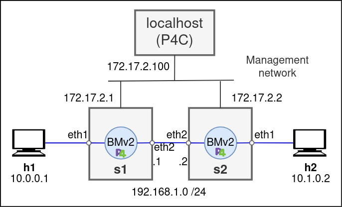

<p align="left">
  


# ESCENARIO DE CAPA 3 con P4 y BMv2 en VNX


## Índice
- [Introducción](#introducción)
- [Objetivos](#objetivos)
- [Topología](#topología)
- [Despliegue](#despliegue)
- [Arranque de BMv2 (tmux)](#inicialización-de-bmv2-tmux)
- [Población de tablas](#población-de-tablas-l3)
  - [Opción A — P4Runtime (gRPC)](#opción-a--p4runtime-grpc)
  - [Opción B — CLI Thrift](#opción-b--cli-thrift)
- [Validación](#validación)


---

## Introducción

Escenario para encaminamiento IPv4 (Capa 3) con P4/BMv2 sobre LXC + VNX. El pipeline P4 utiliza una tabla ipv4_lpm (`LPM sobre hdr.ipv4.dstAddr`) cuya acción principal reescribe MAC de siguiente salto y selecciona puerto. Los switches se ejecutan en tmux para no bloquear el despliegue y las reglas pueden instalarse con CLI Thrift o P4Runtime (gRPC).


---

## Objetivos

- Implementar **reenvío L3** con prefijos IPv4 en BMv2.
- Validar conectividad **h1 ⇄ h2** (ICMP) a través de `s1` y `s2`.
- Practicar **instalación de reglas** con Thrift y/o P4Runtime.

---

## Topología




- Nodos: `h1`, `s1`, `s2`, `h2` (LXC gestionados por VNX).
- Enlaces de datos entre switches: `eth2` (y opcionalmente otros).
- **Gestión** (gRPC/Thrift): `eth3` en cada switch (p. ej., `s1=172.17.2.1/24`, `s2=172.17.2.2/24`).
- Vista del escenario en VNX: `imagenes/mapa_vnx_l3.png` (opcional).

---


## RESUMEN  EJECUTIVO:

**Si solo quieres validar el escenario :**


1) Crear el escenario

```python
 sudo vnx -f p4_vnx.xml -v --create

```
 (El XML arranca BMv2 en tmux.)

2) Ejecutar el controlador y probar**

 ```python
 python3 controlador.py
 ```

 3) Realiza las pruebas mediante ping de h1 a h2:

  ```python
  ping 10.1.0.2
  ```
 
 4) Limpieza

```python
 sudo vnx -f p4_vnx.xml -v --destroy
 # sudo vnx --clean-host   # limpieza total (opcional)
 ```
---


Ahora se muestra a detalle el paso a paso:


## Instrucciones de despliegue

### Crear el escenario

```bash
sudo vnx -f p4_vnx.xml -v --create
```

Limpiar el escenario


```python
sudo vnx -f p4_vnx.xml -v --destroy

```

O alternativamente:

```python
sudo vnx --clean-host

```

## Despliegue

Crear y visualizar el escenario:

```bash
sudo vnx -f p4_vnx.xml -v --create
sudo vnx -f p4_vnx.xml -v --show-map
```

Destruir / limpiar:

```bash
sudo vnx -f p4_vnx.xml -v --destroy
sudo vnx --clean-host
```

---


#### Ver Topologia VNX.

```python
ibdn@ibdn-VirtualBox:~/TFG_P4-main/TFG_P4-main$ sudo vnx -f p4_vnx.xml -v --show-map 
```


## Programa P4 y compilación

`l3.p4` define la tabla LPM para IPv4 y sus acciones de reenvío:

```p4
table ipv4_lpm {
  key = { hdr.ipv4.dstAddr : lpm; }
  actions = { ipv4_forward; drop; }
  size = 1024;
  default_action = drop();
}
```

Compilar para BMv2/v1model:

```bash
p4c --target bmv2 --arch v1model --p4runtime-files my_program.p4rt.txt my_program.p4
```


---

## Inicialización de BMv2 (tmux)

El XML ya arranca BMv2 en **tmux** para evitar bloquear la creación del escenario.

Comprobaciones rápidas (desde el host):
```bash
sudo lxc-attach -n s1 -- tmux list-sessions
sudo lxc-attach -n s1 -- lsof -i -P -n | egrep '9090|9559'
sudo lxc-attach -n s2 -- lsof -i -P -n | egrep '9091|9559'
```

Arranque manual (alternativo) dentro de cada LXC:
```bash
# Opción A: con PATH al binario
export PATH=$PATH:/behavioral-model/targets/simple_switch_grpc/
tmux new-session -d -s switch1 simple_switch_grpc --no-p4   -i 1@eth1 -i 2@eth2 -i 4@eth4 --thrift-port 9090 --device-id 1

# Opción B: desde el target
cd /behavioral-model/targets/simple_switch_grpc/
tmux new-session -d -s switch2 ./simple_switch_grpc --no-p4   -i 1@eth1 -i 2@eth2 -i 4@eth4 --thrift-port 9091 --device-id 2
```

Adjuntar/desconectar:
```bash
sudo lxc-attach -n s1 -- tmux attach -t switch1   # Ctrl+b, luego d para salir
```

---


---

## Población de tablas L3

### Opción A — P4Runtime (gRPC)
Ejemplo con `p4utils` desde el **host** (adaptar rutas/IPs si cambian):
```python
# controlador.py (extracto)
from p4utils.utils.sswitch_p4runtime_API import SimpleSwitchP4RuntimeAPI

s1 = SimpleSwitchP4RuntimeAPI(device_id=1, grpc_ip='172.17.2.1', grpc_port=9559,
                              p4rt_path='l3.p4rt.txt', json_path='l3.json')
s1.table_set_default('ipv4_lpm', 'drop')
s1.table_add('ipv4_lpm', 'ipv4_forward', ['10.0.0.1/32'], ['02:fd:00:00:00:01','1'])
s1.table_add('ipv4_lpm', 'ipv4_forward', ['10.1.0.0/24'], ['02:fd:00:00:03:02','2'])
s1.table_add('ipv4_lpm', 'ipv4_forward', ['172.17.2.0/24'], ['02:fd:00:00:02:03','3'])
```
Se repite para `s2` con su `grpc_ip` y los prefijos/MAC adecuados.


**Ejecutar:**

```bash
python3 controlador.py
```

### Opción B — CLI Thrift
En **s1** (puerto 9090):
```python
# s1
/behavioral-model/tools/runtime_CLI.py --thrift-port 9090
table_add MyIngress.ipv4_lpm MyIngress.ipv4_forward 10.0.0.1/32 => 02:fd:00:00:00:01 1
table_add MyIngress.ipv4_lpm MyIngress.ipv4_forward 10.1.0.0/24 => 02:fd:00:00:03:02 2
table_add MyIngress.ipv4_lpm MyIngress.ipv4_forward 172.17.2.0/24 => 02:fd:00:00:02:03 3
table_set_default MyIngress.ipv4_lpm MyIngress.drop
```

```python
# s2
/behavioral-model/tools/runtime_CLI.py --thrift-port 9091
table_add MyIngress.ipv4_lpm MyIngress.ipv4_forward 10.1.0.2/32 => 02:fd:00:00:01:01 1
table_add MyIngress.ipv4_lpm MyIngress.ipv4_forward 10.0.0.0/24 => 02:fd:00:00:02:02 2
table_add MyIngress.ipv4_lpm MyIngress.ipv4_forward 172.17.2.0/24 => 02:fd:00:00:03:03 3
table_set_default MyIngress.ipv4_lpm MyIngress.drop
```

---

## Validación

Conectividad:
```bash
# Desde h1
ping 10.1.0.2
```


Tablas en el switch:
```bash
/behavioral-model/tools/runtime_CLI.py --thrift-port 9091
table_dump MyIngress.ipv4_lpm
```


Puertos/servicios y trazas:
```bash
sudo lxc-attach -n s1 -- lsof -i -P -n | egrep '9090|9559'
sudo lxc-attach -n s1 -- netstat -tuln | grep 9559
sudo lxc-attach -n s1 -- tcpdump -i eth1 -vv
```

Consulta de tablas:


Ping de h1 a h2 con vista CLI en s1 y s2


---

