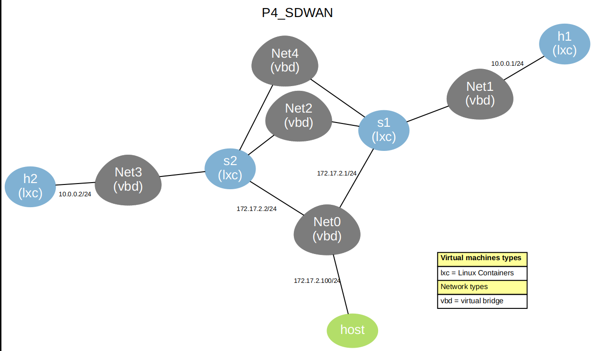

<p align="left">
  


# Escenario SD‑WAN con P4 y BMv2 en VNX

Este escenario implementa una **política SD‑WAN a nivel de Capa 4** sobre **switches P4 BMv2** (`simple_switch_grpc`) en **LXC** orquestados con **VNX**. **Todo flujo TCP/UDP con puerto 6000** se **prioriza por el enlace `eth4` (MPLS)**, mientras que **cualquier otro tráfico** se **encamina por `eth2` (Internet)**. Los switches arrancan en **tmux** para no bloquear el despliegue y el plano de datos se programa dinámicamente con **P4Runtime** desde un controlador en Python.

### Resumen rápido:

1) **Crear el escenario**: 

```python
sudo vnx -f p4_sdwan.xml -v --create
```

2) **Compilar programa con p4c**

```python
sudo p4c --target bmv2 --arch v1model --p4runtime-files sdwan.p4info.txt sdwan.p4
```

3) **Ejecutar el controlador**

```python
    sudo python3 sdwan_controlador.py --prio-port 6000 --proto both --clear-prio
```

4) **Recalcular checksums en egreso del host** 

```python
./disable-offloads-OK.sh
```

5) **Pruebas**:  Comprueba con `iperf` y `tcpdump` que **6000 → eth4**, resto **→ eth2** (ver _Pruebas_).

---


## Diseño y Topología


Topología con cuatro nodos LXC: **h1** y **h2** (hosts), **s1** y **s2** (switches BMv2).  
Enlaces:
- `Net1`: h1 ↔ s1 (10.0.0.0/24)
- `Net3`: h2 ↔ s2 (10.0.0.0/24)
- `Net2`: s1 ↔ s2 (**Internet**) → mapeado a **eth2** en cada switch
- `Net4`: s1 ↔ s2 (**MPLS**) → mapeado a **eth4** en cada switch
- `Net0`: **Gestión** (172.17.2.0/24) hacia el controlador (gRPC/Thrift)

> En `p4_sdwan.xml`, h1/h2 fijan ARP estático entre sí para simplificar pruebas, y s1/s2 arrancan **simple_switch_grpc** en **tmux** con interfaces `eth1`, `eth2` y `eth4` expuestas (gestión por `eth3`).

## INSTRUCCIONES:

### Ejecutar escenario.

```python
   sudo vnx -f p4_sdwan.xml -v --create 
```


**Ver mapa/topología**

```python
sudo vnx -f p4_sdwan.xml -v --show-map

```



---

**NOTA:al finalizar para limpiar escenario.**

```python
sudo vnx -f p4_vnx.xml -v --destroy 


```
O utilizar 

```python
sudo vnx --clean-host

```

---


## Compilar programa p4 con p4c

```python
sudo p4c --target bmv2 --arch v1model --p4runtime-files sdwan.p4info.txt sdwan.p4
```


## programar reglas (prioridad puerto 6000 por eth4; resto por eth2)**  

`## Ejecución del controlador (P4Runtime)

**Reglas instaladas por el controlador:**
- **Prioridad** (TCP/UDP **puerto 6000**): acción `set_nexthop_prio` → **eth4** (enlace MPLS).
- **Tráfico general**: coincide en LPM/tabla base y sale por **eth2** (Internet).

### Ejecutar con ambos protocolos (recomendado)
```bash
sudo python3 sdwan_controlador.py   --p4info sdwan.p4info.txt --json sdwan.json   --s1-ip 172.17.2.1 --s2-ip 172.17.2.2   --s1-grpc 9559     --s2-grpc 9559   --prio-port 6000 --proto both
```

### Sólo TCP o sólo UDP
```bash
# TCP
sudo python3 sdwan_controlador.py   --p4info sdwan.p4info.txt --json sdwan.json   --s1-ip 172.17.2.1 --s2-ip 172.17.2.2   --s1-grpc 9559     --s2-grpc 9559   --prio-port 6000 --proto tcp

# UDP
sudo python3 sdwan_controlador.py   --p4info sdwan.p4info.txt --json sdwan.json   --s1-ip 172.17.2.1 --s2-ip 172.17.2.2   --s1-grpc 9559     --s2-grpc 9559   --prio-port 6000 --proto udp
```

> `--proto both` instala **cuatro tablas de prioridad** (`prio_tcp_src`, `prio_tcp_dst`, `prio_udp_src`, `prio_udp_dst`) en **s1** y **s2**. Si ejecutas TCP y luego UDP con `--clear-prio`, borrarás lo anterior; usa `--proto both` o ejecuta sin `--clear-prio` la segunda vez.

---

## Pruebas y validaciones

### 1) Tráfico **prioritario** (6000 → **eth4**)
En **h2** (servidor “VoIP‑GW”):
```bash
# TCP
iperf -s -p 6000


# UDP
iperf -s -u -p 6000 -i 1
```


En **h1** (emisor):
```bash
# TCP
iperf -c 10.0.0.2 -p 6000 -t 3 -i 1

# UDP
iperf -c 10.0.0.2 -u -p 6000 -b 2M -l 1200 -t 3 -i 1
```


### 3) Verificaciones adicionales
```bash
# Ping entre hosts
ping -c 3 10.0.0.2

# Filtrar SYN/SYN-ACK en h1/h2 (útil si ves checksums “incorrect”)
tcpdump -i eth1 -nnvvv "tcp port 6000 and (tcp[tcpflags] & (tcp-syn|tcp-ack) != 0)"

# Copiar logs desde los LXC al directorio actual del host
sudo cp /var/lib/lxc/s1/rootfs/root/s1-bmv2.log .
sudo cp /var/lib/lxc/s2/rootfs/root/s2-bmv2.log .
```


---

## Resultados con Wireshark  


- **Puerto 6000 (TCP/UDP)** fluye por **eth4** (MPLS). 


- **Resto de puertos** fluyen por **eth2** (Internet).

**ICMP en puerto eth2**


---

**UDP puerto 2000 en eth2**


## Depuración (CLI/Thrift y logs)


### CLI de BMv2 (Thrift)
```bash
# S1
simple_switch_CLI --thrift-port 9090
  table_dump IngressImpl.dmac
  table_dump IngressImpl.prio_udp_dst
  table_dump IngressImpl.prio_udp_src
  table_dump IngressImpl.prio_tcp_dst
  table_dump IngressImpl.prio_tcp_src

# S2
simple_switch_CLI --thrift-port 9091
  table_dump IngressImpl.dmac
  table_dump IngressImpl.prio_udp_dst
  table_dump IngressImpl.prio_udp_src
  table_dump IngressImpl.prio_tcp_dst
  table_dump IngressImpl.prio_tcp_src


# Utilidades
show_tables
show_actions
```

